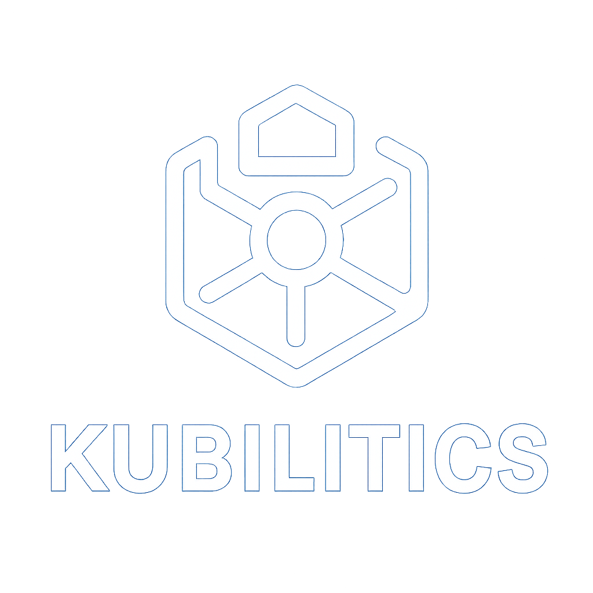

<p align="center">
  
</p>

<h1 align="center">Kubilitics</h1>

<p align="center">
  <strong>The Kubernetes Operating System</strong><br />
  Multi-cluster management, real-time topology, powerful CLI operations — all from one platform.
</p>

<p align="center">
  <a href="https://github.com/kubilitics/kubilitics/releases"></a>
  <a href="https://github.com/kubilitics/kubilitics/actions"></a>
  <a href="https://github.com/kubilitics/kubilitics/blob/main/LICENSE"></a>
  <a href="https://kubilitics.com"></a>
</p>

<p align="center">
  <a href="#-quick-start">Quick Start</a> •
  <a href="#-features">Features</a> •
  <a href="#-multi-cluster-demo">Demo</a> •
  <a href="#%EF%B8%8F-helm-deployment-in-cluster">Helm Deploy</a> •
  <a href="#-desktop-app">Desktop</a> •
  <a href="#-architecture">Architecture</a> •
  <a href="#-documentation">Docs</a>
</p>

---

## Why Kubilitics?

| Problem | Kubilitics Solution |
|---------|-------------------|
| kubectl is powerful but opaque | **Visual resource intelligence** — see every resource, relationship, and status at a glance |
| Lens is deprecated / desktop-only | **Web + Desktop + In-Cluster** — deploy anywhere, access from any browser |
| Headlamp lacks multi-cluster | **True multi-cluster** — switch between Docker Desktop, EKS, AKS, GKE in one click |
| CLI is disconnected | **Integrated CLI** — kcli (kubectl wrapper) with cluster context management and blast radius analysis |
| Topology is afterthought | **Topology-first** — 5 view modes, semantic zoom, relationship inference, export to PNG, SVG, JSON, CSV |

---

## 🚀 Quick Start

### Option 1: Web App (fastest — 2 minutes)

```bash
# 1. Start the backend
cd kubilitics-backend
go run ./cmd/server
# Backend running at http://localhost:8190

# 2. Start the frontend (in a new terminal)
cd kubilitics-frontend
npm install && npm run dev
# Open http://localhost:5173
```

On first visit, choose **Personal** (local kubeconfig) or **Team Server** (Helm in-cluster).
Your `~/.kube/config` is auto-detected — clusters appear automatically.

### Option 2: Desktop App (macOS / Windows / Linux)

```bash
cd kubilitics-desktop
npm install
cargo tauri dev
```

The desktop app bundles the backend as a sidecar — no separate server needed.

### Option 3: Helm (In-Cluster Deployment)

See [Helm Deployment](#%EF%B8%8F-helm-deployment-in-cluster) below.

---

## ✨ Features

### Multi-Cluster Management

Connect and switch between clusters instantly. Tested with:

| Provider | Verified | Notes |
|----------|----------|-------|
| Docker Desktop | ✅ | Auto-detected from `~/.kube/config` |
| AWS EKS | ✅ | Contexts from `aws eks update-kubeconfig` |
| Azure AKS | ✅ | Contexts from `az aks get-credentials` |
| GKE | ✅ | Contexts from `gcloud container clusters get-credentials` |
| k3s / k3d | ✅ | Auto-detected |
| kind | ✅ | Auto-detected |
| Minikube | ✅ | Auto-detected |
| Rancher / RKE2 | ✅ | Via kubeconfig |

### Resource Intelligence (70+ Resource Types)

Every Kubernetes resource type with real-time status, metrics, and drill-down:

**Workloads** — Pods, Deployments, StatefulSets, DaemonSets, Jobs, CronJobs, ReplicaSets
**Networking** — Services, Ingresses, NetworkPolicies, EndpointSlices, Gateways (Gateway API)
**Storage** — PVCs, PVs, StorageClasses, VolumeSnapshots, VolumeAttachments
**Config** — ConfigMaps, Secrets, ResourceQuotas, LimitRanges, HPAs, VPAs
**RBAC** — Roles, ClusterRoles, RoleBindings, ClusterRoleBindings, ServiceAccounts
**CRDs** — Custom Resource Definitions with automatic discovery
**Cluster** — Nodes, Namespaces, Events, Leases, PriorityClasses, RuntimeClasses

### Topology Engine (5 View Modes)

Interactive cluster topology powered by React Flow + ELK layout:

- **Cluster View** — Full cluster graph with all resource relationships
- **Namespace View** — Scoped to a namespace with inter-resource connections
- **Workload View** — Deployment → ReplicaSet → Pod → Container chain
- **Resource-Centric** — BFS traversal from any resource with configurable depth
- **RBAC View** — ServiceAccount → Role → RoleBinding permission graph

Export: PNG, SVG, JSON, CSV

### CLI & Operations

- **kcli** — Integrated kubectl with cluster context management
- **Blast Radius Calculator** — Predict impact before making changes
- **In-browser terminal** — Shell access with tab completion and context switching

### Dashboard & Monitoring

- Cluster health score with real-time metrics (CPU, Memory, Pod utilization)
- Capacity planning with donut gauges and trend analysis
- Fleet dashboard for multi-cluster overview
- Event stream with severity filtering

### Security & Auth

- SSO / OIDC / SAML authentication
- RBAC management (Admin / Operator / Viewer) with per-cluster permissions
- Audit logging with CSV export
- API key authentication for programmatic access
- MFA / TOTP support

---

---

## ⎈ Helm Deployment (In-Cluster)

Deploy Kubilitics to your Kubernetes cluster for team-wide access.

### Prerequisites

| Requirement | Version |
|-------------|---------|
| Kubernetes | ≥ 1.24 |
| Helm | ≥ 3.8 (OCI support) |
| kubectl | configured |

### Install

```bash
# Install from OCI registry (recommended)
helm install kubilitics \
  oci://ghcr.io/kubilitics/charts/kubilitics \
  --version 0.1.0 \
  --namespace kubilitics --create-namespace
```

```bash
# Or install from source
git clone https://github.com/kubilitics/kubilitics.git
helm install kubilitics ./deploy/helm/kubilitics \
  --namespace kubilitics --create-namespace
```

### Verify

```bash
kubectl get pods -n kubilitics
kubectl get svc -n kubilitics
```

### Access (port-forward for local testing)

```bash
kubectl port-forward -n kubilitics svc/kubilitics 8190:8190
# Open http://localhost:5173 and set backend URL to http://localhost:8190
```

### Production (with Ingress)

```bash
helm install kubilitics \
  oci://ghcr.io/kubilitics/charts/kubilitics \
  --version 0.1.0 \
  --namespace kubilitics --create-namespace \
  --set ingress.enabled=true \
  --set ingress.hosts[0].host=kubilitics.example.com \
  --set config.allowedOrigins="https://kubilitics.example.com"
```

### Full Configuration Reference

```bash
helm show values oci://ghcr.io/kubilitics/charts/kubilitics --version 0.1.0
```

Key configuration options:

| Parameter | Default | Description |
|-----------|---------|-------------|
| `image.tag` | `0.1.2` | Backend image version |
| `service.port` | `8190` | Backend service port |
| `database.type` | `sqlite` | `sqlite` or `postgresql` |
| `ingress.enabled` | `false` | Enable Ingress |
| `rbac.enabled` | `true` | Create RBAC resources |
| `persistence.enabled` | `true` | Persistent storage for SQLite |
| `config.authMode` | `required` | `required`, `optional`, or `disabled` |
| `serviceMonitor.enabled` | `false` | Prometheus ServiceMonitor |

---

## 🖥️ Desktop App

Native desktop application built with Tauri 2.0 (Rust + WebView):

- **Auto-discovery** — detects `~/.kube/config` on launch
- **Sidecar backend** — Go backend + kcli bundled as child processes
- **Offline-first** — works without internet for local clusters
- **Cross-platform** — macOS (.dmg), Windows (.msi), Linux (.deb/.AppImage)

### Build from Source

```bash
cd kubilitics-desktop
npm install
cargo tauri build
```

| Platform | Output |
|----------|--------|
| macOS | `src-tauri/target/release/bundle/dmg/Kubilitics.dmg` |
| Windows | `src-tauri/target/release/bundle/msi/Kubilitics.msi` |
| Linux | `src-tauri/target/release/bundle/deb/kubilitics.deb` |

---

## 🏗️ Architecture

```
┌──────────────────────────────────────────────────────────────────┐
│                         KUBILITICS                                │
├──────────────────────────────────────────────────────────────────┤
│                                                                    │
│   ┌─────────────┐  ┌──────────────┐  ┌──────────────────────┐  │
│   │  Desktop     │  │  Web App     │  │  In-Cluster (Helm)   │  │
│   │  Tauri 2.0   │  │  React+Vite  │  │  K8s Deployment      │  │
│   └──────┬───────┘  └──────┬───────┘  └──────────┬───────────┘  │
│          │                  │                      │               │
│          └──────────────────┼──────────────────────┘               │
│                             │                                      │
│                    ┌────────▼────────┐                             │
│                    │   Go Backend    │  REST API + WebSocket       │
│                    │   Port 8190    │  SQLite / PostgreSQL        │
│                    └────────┬────────┘                             │
│                             │                                      │
│              ┌──────────────┼──────────────┐                      │
│              │              │              │                       │
│     ┌────────▼──────┐ ┌────▼─────┐                               │
│     │  Topology     │ │  K8s     │                               │
│     │  Engine       │ │  Client  │                               │
│     │  (ELK+React   │ │  (client │                               │
│     │   Flow)       │ │   -go)   │                               │
│     └───────────────┘ └────┬─────┘                               │
│                             │                                      │
│                    ┌────────▼────────┐                             │
│                    │  Kubernetes     │                             │
│                    │  Cluster(s)     │                             │
│                    │  EKS / AKS /   │                             │
│                    │  GKE / Docker   │                             │
│                    └─────────────────┘                             │
└──────────────────────────────────────────────────────────────────┘
```

### Repository Structure

```
kubilitics/
├── kubilitics-backend/        # Go REST API + WebSocket + Topology Engine
│   ├── cmd/server/            # Entry point (port 8190)
│   ├── internal/
│   │   ├── api/               # REST handlers, WebSocket hub
│   │   ├── k8s/               # Kubernetes client (client-go)
│   │   ├── topology/          # Graph builder, ELK layout, relationship inference
│   │   ├── service/           # Business logic, add-on platform
│   │   └── config/            # Configuration, env vars
│   └── go.mod
│
├── kubilitics-frontend/       # React + TypeScript + Vite SPA
│   ├── src/pages/             # 80+ resource pages
│   ├── src/components/        # Reusable UI components
│   ├── src/hooks/             # React Query hooks, K8s data fetching
│   ├── src/stores/            # Zustand state management
│   └── package.json
│
├── kubilitics-desktop/        # Tauri 2.0 desktop app (Rust)
│   ├── src-tauri/             # Rust sidecar manager
│   └── src/                   # Shared frontend
│
├── deploy/helm/kubilitics/    # Helm chart for in-cluster deployment
│   ├── Chart.yaml             # v0.1.0
│   ├── values.yaml            # All configurable values
│   └── templates/             # K8s resource templates
│
└── docs/                      # Architecture, runbooks, guides
```

### Tech Stack

| Layer | Technology |
|-------|-----------|
| Frontend | React 18, TypeScript, Vite, Tailwind CSS, Framer Motion |
| State | Zustand, TanStack Query (React Query) |
| Topology | React Flow, ELK.js (layered layout) |
| Backend | Go 1.24, Gorilla Mux, client-go, SQLite/PostgreSQL |
| Desktop | Tauri 2.0 (Rust), WebView2/WKWebView |
| CLI | kcli (kubectl wrapper with shell integration) |
| CI/CD | GitHub Actions, Helm OCI (ghcr.io) |
| Charts | OCI artifacts at `oci://ghcr.io/kubilitics/charts` |

---

## 🧪 Development

### Prerequisites

- **Go** 1.24+ (backend)
- **Node.js** 20+ (frontend)
- **Rust** 1.75+ (desktop only)
- **Kubernetes cluster** (any — Docker Desktop works)

### Run Everything (two terminals)

```bash
# Terminal 1: Backend
cd kubilitics-backend && go run ./cmd/server

# Terminal 2: Frontend
cd kubilitics-frontend && npm install && npm run dev
```

Backend: http://localhost:8190 • Frontend: http://localhost:5173 • Metrics: http://localhost:8190/metrics

### Tests

```bash
# Backend
cd kubilitics-backend && go test -count=1 ./...

# Frontend
cd kubilitics-frontend && npm run test

# Vulnerability scan
cd kubilitics-backend && govulncheck ./...
```

### Build

```bash
# Backend binary
cd kubilitics-backend && go build -o bin/kubilitics-backend ./cmd/server

# Frontend production build
cd kubilitics-frontend && npm run build

# Desktop
cd kubilitics-desktop && npm install && cargo tauri build
```

---

## 📖 Documentation

| Document | Description |
|----------|-------------|
| [Architecture](docs/ARCHITECTURE.md) | System design and component architecture |
| [Integration Model](docs/INTEGRATION-MODEL.md) | Frontend ↔ Backend communication patterns |
| [Topology API](docs/TOPOLOGY-API-CONTRACT.md) | Topology response shape (nodes, edges, metadata) |
| [OpenAPI Spec](docs/api/openapi-spec.yaml) | REST API specification |
| [Release Standards](docs/RELEASE-STANDARDS.md) | Pre-release gate and quality checklist |
| [Helm Chart README](deploy/helm/kubilitics/README.md) | Chart configuration reference |
| [PostgreSQL Guide](docs/guides/postgresql-deployment.md) | Production database setup |
| [Horizontal Scaling](docs/guides/horizontal-scaling.md) | Multi-replica deployment |
| [Backup & Restore](docs/runbooks/backup-restore.md) | Database backup procedures |
| [JWT Rotation](docs/runbooks/rotate-jwt-secrets.md) | Secret rotation runbook |
| [SQLite → PostgreSQL](docs/runbooks/migrate-sqlite-postgresql.md) | Database migration guide |

---

## 🔄 Comparison

| Feature | Kubilitics | Lens | Headlamp | k9s |
|---------|-----------|------|----------|-----|
| Multi-cluster | ✅ Unified | ✅ | ⚠️ Limited | ❌ Single |
| Web access | ✅ Browser + Desktop | ❌ Desktop only | ✅ Web | ❌ Terminal |
| In-cluster deploy | ✅ Helm | ❌ | ✅ Helm | ❌ |
| Topology visualization | ✅ 5 modes + export | ❌ | ❌ | ❌ |
| Integrated CLI | ✅ kcli + shell | ❌ | ❌ | ❌ |
| 70+ resource types | ✅ | ✅ | ⚠️ ~30 | ✅ |
| Dark mode | ✅ System + manual | ✅ | ✅ | ✅ |
| Open source | ✅ Apache 2.0 | ❌ Proprietary | ✅ Apache 2.0 | ✅ Apache 2.0 |
| CRD support | ✅ Auto-discovery | ✅ | ⚠️ | ✅ |
| RBAC management | ✅ Visual | ⚠️ | ❌ | ❌ |
| Cost analysis | ✅ | ❌ | ❌ | ❌ |

---

## 🤝 Contributing

1. Fork the repository
2. Create a feature branch: `git checkout -b feature/my-feature`
3. Run tests: `cd kubilitics-backend && go test ./... && cd ../kubilitics-frontend && npm run test`
4. Commit: `git commit -m 'feat: add my feature'`
5. Push: `git push origin feature/my-feature`
6. Open a Pull Request

See [CONTRIBUTING.md](CONTRIBUTING.md) for detailed guidelines.

---

## 📜 License

Apache 2.0 — See [LICENSE](LICENSE) for details.

---

## 📧 Links

- **Website**: [kubilitics.com](https://kubilitics.com)
- **GitHub**: [github.com/kubilitics/kubilitics](https://github.com/kubilitics/kubilitics)
- **Issues**: [github.com/kubilitics/kubilitics/issues](https://github.com/kubilitics/kubilitics/issues)
- **Helm Charts**: `oci://ghcr.io/kubilitics/charts/kubilitics`

---

<p align="center">
  <strong>Built with ❤️ by the Kubilitics team</strong><br />
  <sub>The Kubernetes Operating System — making K8s human-friendly.</sub>
</p>
